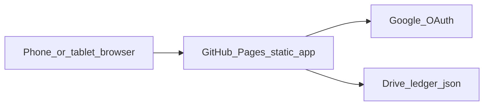
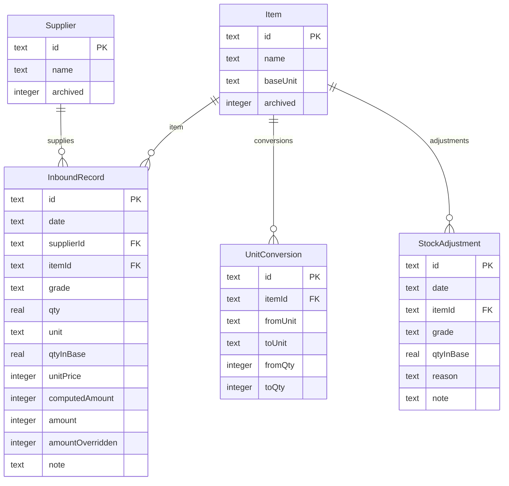

# Phase 1：進貨帳冊與庫存 — 設計

狀態：待確認  
規格：[spec.md](./spec.md) · 任務：[tasks.md](./tasks.md)

## 1. 技術取捨

| 項目 | 選擇 | 理由 |
|---|---|---|
| 託管 | GitHub Pages | 使用者要求；靜態免費、手機直接開網址 |
| 框架 | Next.js `output: 'export'` + TypeScript | 仍用 React+Next；Pages **不能跑** Server Actions／Node SQLite |
| 樣式 | Tailwind CSS | 響應式手機／平板／桌機 |
| 主檔 | Google Drive 上一份 JSON | 綁個人 Google 帳號；換機登入即還原 |
| 登入 | Google Identity Services（OAuth） | 使用者綁定自己的雲端，不是 App 共用帳密 |
| 驗證 | Zod（瀏覽器內） | 無後端，仍要同一套規則 |
| 日期／金額／單位 | 純函式 | 與託管無關，須測 |
| 快取 | 可選 localStorage 加速 | Drive 仍是唯一正式來源 |

GitHub repo **只放程式**。OAuth Client ID 用 `NEXT_PUBLIC_`（前端可見），在 Google Cloud 限制來源為 GitHub Pages 網址。



### 1.1 應用結構（實作時建立）

全部為 Client Component（靜態匯出）。`basePath` 對應 repo 名（如 `/InvoMate`）。

```
app/
  layout.tsx               viewport、AuthGate
  page.tsx                 → 導向 /inbounds
  inbounds/ ...
  stock/ ...
  adjustments/ ...
  suppliers/ ...
  items/ ...
lib/
  store.ts                 記憶體帳本 + 自動存
  drive.ts                 尋找／建立／讀／寫 JSON
  auth.ts                  Google 登入／登出
  calendar.ts money.ts units.ts stock.ts
  query.ts                 進貨多條件過濾與排序
  drive.ts                 JSON 主檔 + 上傳匯出檔
  seed.ts                  預設供應商／品項
.github/workflows/pages.yml
```

路由在 GitHub Pages 需處理子路徑：`trailingSlash` 或 `404.html` 複製成各路徑；或 hash 路由。實作時選一種並在 README 寫死。

### 1.2 雲端檔案

- 位置：使用者雲端硬碟資料夾 `InvoMate/invomate-ledger.json`（可見，方便心理上「在我的 Google 雲端」）。
- 權限：OAuth scope 以能建立與讀寫**本 App 建立的檔**為準（`drive.file`），不要要全硬碟讀取。
- 內容：一個 JSON 文件，內含各集合（對應下列實體），加 `version`、`updatedAt`。
- 寫入：debounce 後整檔 `update`。單人帳本體積很小。
- 不要用 `.db`／SQLite 檔放 Drive（瀏覽器不好鎖檔）。不要用 Docs／Sheets 當主檔。

### 1.3 初始化與儲存流程

1. 進站 → 未登入則 Google 按鈕。
2. 登入成功 → `drive.ts` 找或建立 JSON → Zod 解析 → 載入 store；新檔則寫入種子主檔。
3. 任何變更 → store 更新 → debounce → 寫回 Drive → 「已儲存」。
4. 寫入失敗 → 「儲存失敗、請重試」，保留記憶體變更以免使用者重打；可手動「立即儲存」。

開發用 `next dev` 即可；正式用 GitHub Actions 建靜態檔並 deploy Pages。

## 2. 領域模型



庫存**不另存餘額集合**。餘額 = 進貨 `qtyInBase` 加總 + 調整 `qtyInBase` 加總。

## 3. JSON 集合欄位

整份帳本一個檔。ID 用 UUID 字串。時間戳 `createdAt` / `updatedAt` 每筆都有（ISO datetime）。`archived` 用 0/1 或 boolean，匯出前後一致即可。

根物件：`{ version: 1, updatedAt, suppliers, items, unitConversions, inboundRecords, stockAdjustments }`。

### 3.1 `suppliers`

| 欄位 | 型別 | 規則 |
|---|---|---|
| id | text PK | UUID |
| name | text unique | 去前後空白，不可空 |
| archived | integer | 0/1；停用後不可再選，舊單仍顯示名稱 |

種子：陳美美、溪湖、山上、王小姐、西螺。可另加「未指定」供手記沒寫供應商的糖粉列使用。

### 3.2 `items`

| 欄位 | 型別 | 規則 |
|---|---|---|
| id | text PK | UUID |
| name | text unique | 不可空 |
| baseUnit | text | 列舉：`jin`（斤）、`bag`（包）。新增品項時必選 |
| archived | integer | 0/1 |

種子：

- 紫山藥 `jin`
- 糖 `bag`
- 三花麵粉 `bag`
- 地瓜粉 `bag`

畫面顯示用中文：斤、包、箱（`box` 只當輔助單位，不當 `baseUnit`）。

### 3.3 `unit_conversions`

| 欄位 | 型別 | 規則 |
|---|---|---|
| id | text PK | |
| itemId | text FK | |
| fromUnit | text | 如 `box` |
| toUnit | text | 必須等於該品項 `baseUnit` |
| fromQty | integer | 正整數，紫山藥箱→斤為 100 |
| toQty | integer | 正整數，紫山藥為 3333 |

公式：

```
qtyInBase = qty * (toQty / fromQty)
```

紫山藥：`qtyInBase = qty * 3333 / 100`。50 箱 → 1666.5。

同一品項同一 `fromUnit` 只能一筆。沒有換算列時，只允許用基準單位登打。

### 3.4 `inbound_records`

| 欄位 | 型別 | 規則 |
|---|---|---|
| date | text | `YYYY-MM-DD`，必須是真實日曆日 |
| supplierId | text FK | |
| itemId | text FK | |
| grade | text | 空字串 = 未分級；「醜」等自由文字，建議下拉：未分級／醜／其他（其他可輸入） |
| qty | real | \> 0 |
| unit | text | 該品項基準單位或已設定的輔助單位 |
| qtyInBase | real | 伺服器依換算寫入，用戶不可直接改 |
| unitPrice | integer | ≥ 0（元／使用者選的單位） |
| computedAmount | integer | `qty * unitPrice` 四捨五入到整數 |
| amount | integer | 實際入帳金額；預設等於 `computedAmount` |
| amountOverridden | integer | `amount !== computedAmount` 時為 1 |
| note | text | 可空 |

`qty` 為箱時，`unitPrice` 是每箱單價（王小姐 1,800 或用斤 54 則應改用單位斤、數量 3333）。

刪除進貨：Phase 1 允許刪除（單人帳）；刪後庫存重算。不做軟刪。

### 3.5 `stock_adjustments`

| 欄位 | 型別 | 規則 |
|---|---|---|
| date | text | ISO 日 |
| itemId | text FK | |
| grade | text | 與進貨相同語意，對齊庫存鍵 |
| qtyInBase | real | 可正可負，不可為 0 |
| reason | text | `stocktake` 盤點、`consume` 耗用、`spoilage` 報損、`other` 其他 |
| note | text | 原因為 other 時建議必填 |

無金額欄。Phase 2 若要「剩餘庫存價值 −17,650」再擴充。

## 4. 計算模組（純函式，須測）

### 4.1 民國日期 `lib/calendar.ts`

- `rocToIso(year, month, day)` → `YYYY-MM-DD` 或丟錯（無效日含 12/38、2/29 非閏年）。
- `isoToRoc(iso)` → `{ year, month, day }`，year = 西元 − 1911。
- 不自動修正無效日。

### 4.2 金額 `lib/money.ts`

```
computedAmount(qty, unitPrice) = Math.round(qty * unitPrice)
```

覆寫：`amountOverridden = amount !== computedAmount`。差額 `amount - computedAmount`。

### 4.3 單位 `lib/units.ts`

```
qtyInBase(qty, unit, item) =
  unit === item.baseUnit ? qty
  : qty * conversion.toQty / conversion.fromQty
```

無對應換算 → 驗證失敗。

顯示：斤最多 2 位小數、去掉多餘 0；包為整數（允許小數輸入但種子都是整數）。

### 4.4 庫存 `lib/stock.ts`

鍵：`itemId + '\0' + grade`（grade 空字串與「未分級」同一鍵）。

```
balance = sum(inbounds.qtyInBase) + sum(adjustments.qtyInBase)
```

負餘額允許，UI 用警示樣式。

### 4.5 上次單價

查 `inbound_records` where supplierId + itemId + grade，`date DESC, createdAt DESC` 第一筆的 `unitPrice` **與** `unit`。若上次單位與本次不同，仍帶單價但畫面提示單位可能不同，避免把「每箱 1800」套到「每斤」。

## 5. 畫面

共同：導覽「進貨／庫存／調整／供應商／品項」。未登入只顯示登入頁。已登入顯示 Google 帳號與登出、以及「儲存中／已儲存／失敗」。數字用台灣地區千分位。  
`layout` 必須含 `viewport`（Next.js 預設 metadata 即可）：`width=device-width, initial-scale=1`。

### 5.0 響應式斷點與互動

以 Tailwind 預設為準，對齊規格 US-11：

| 名稱 | 寬度（邏輯像素） | 導覽 | 列表 | 表單 |
|---|---|---|---|---|
| 手機 | 小於 `md`（768） | 漢堡選單**或**底部導覽（最多 5 項），點擊展開；當前頁標示 | 卡片；主資訊一屏可讀 | 單欄；主按鈕全寬、貼近拇指 |
| 平板 | `md`–`lg`（768–1023） | 頂部橫列或側欄，不必漢堡 | 表可橫向捲於容器內，或沿用卡片 | 最多兩欄 |
| 桌機 | `lg` 以上（≥ 1024） | 頂部橫列 | 完整表格 | 兩欄、最大寬度約 40rem 置中亦可 |

觸控與輸入：

- 可點元素最小約 44×44px（含導覽、新增、刪除確認）。
- 數量、單價、金額：`inputMode="decimal"` 或 `numeric`，避免跳出完整鍵盤。
- 民國年／月／日三欄在手機可並排（各佔約 1/3），不可讓日期列寬到整頁橫滑。
- 焦點可見；錯誤訊息在欄位下方，不靠 hover。
- 避免 `position: fixed` 小計擋住最後一張卡片的操作列；若固定小計，列表底部留 padding。

驗收視窗：約 390×844、768×1024、1280×800。不以模擬器截圖為自動化必備，實作後用瀏覽器裝置模式手動過一次。

### 5.1 進貨列表 `/inbounds`

- **查詢面板**（手機預設收合為「查詢」；已套用條件以標籤列在面板外）：
  - 供應商、品項：多選
  - 品級、備註關鍵字、僅覆寫
  - 日期起迄（民國）；可快捷「本月／上月／某民國年某月」自動填起迄
  - 金額 min–max、基準數量 min–max、單價 min–max（數字鍵盤）
  - 排序欄位與升降；清除全部
- 表列（平板／桌機）：民國日期、供應商、品項、品級、數量+單位、基準數量、單價、金額；若覆寫則標示差額。
- 卡片（手機）：第一行日期+供應商；第二行品項與品級；第三行數量／單價／金額；覆寫差額一行；編輯／刪除用文字按鈕，不要只靠圖示。
- 小計：查詢後的基準數量合計、金額合計、筆數。手機在標籤下列一條摘要，再重複於列表末端。
- 過濾與排序在 `lib/query.ts`（純函式、須測），對記憶體帳本操作。
- 操作：新增（手機為明顯主按鈕）、編輯、刪除（刪除需確認；確認框在小螢幕可點、不被虛擬鍵盤擋住）。

### 5.2 進貨表單 `/inbounds/new`、`/inbounds/[id]/edit`

欄位順序：日期（民國年／月／日三欄）→ 供應商（可「新增供應商」）→ 品項 → 品級 → 數量 → 單位（依品項過濾）→ 單價 → 金額（可編輯）→ 備註。  
儲存／取消在手機為全寬、表單最底；儲存不要只放在桌機才看得到的頂列。

行為：

1. 選供應商+品項+品級後請求上次單價與單位。
2. 改數量或單價時，若使用者尚未手動改過金額，金額跟著公式走；一旦手動改金額，鎖定覆寫直到使用者按「恢復公式金額」。
3. 選箱時即時顯示「約 xx 斤」。
4. 送出前 Zod + 日曆驗證；失敗停留表單並顯示欄位錯誤。

### 5.3 庫存 `/stock`

列：品項、品級、基準單位、餘額。負數醒目。不顯示金額。  
手機可用簡潔卡片或兩欄列（品項／餘額），不必硬套寬表。

### 5.4 庫存調整 `/adjustments`

列表：日期、品項、品級、增減量、原因、備註。手機同樣卡片化。  
表單強調「這是增減量，不是盤後餘額」；版面規則同進貨表單（單欄／觸控）。

### 5.5 主檔 `/suppliers`、`/items`

名稱新增／重新命名／停用。品項可維護該品項的單位換算（紫山藥預設 100 箱 = 3333 斤）。停用後表單下拉不出現，列表歷史仍顯示。

### 5.6 匯出 xlsx／pdf

進貨頁「匯出」（不要佔底欄第 6 項）。面板選項：

- 格式：xlsx、pdf
- 範圍：目前篩選／全部進貨
- 動作：存到雲端硬碟、下載到此裝置（可兩個都做；預設「存到雲端」因為已登入）

實作要點：

- xlsx：瀏覽器內產生（如 SheetJS）；多工作表；日期顯示民國、另加 ISO 欄方便排序。
- pdf：瀏覽器內產生；**必須能顯示繁體中文**（內嵌 Noto Sans TC 子集或同等）；A4 直向；表頭重複；小計在進貨段末。
- 上傳：`drive.file` 寫入 `InvoMate/exports/`，MIME 分別為 Excel 與 PDF；回傳 webViewLink。
- 不呼叫 Google Sheets API 建立「活的」試算表。使用者若在 Drive 用 Google 試算表打開 xlsx，那是 Google 的預覽，與主檔無關。

## 6. 驗證規則（瀏覽器為準，無後端）

- 日期：存在的日曆日。
- qty > 0；unitPrice ≥ 0；amount ≥ 0。
- supplierId、itemId 必須存在且未停用（編輯舊單時允許已停用的原值）。
- unit 必須是基準單位或該品項已設換算的 fromUnit。
- 調整 qtyInBase ≠ 0。
- 名稱唯一（供應商、品項）。

## 7. 種子資料

第一次在該 Google 帳號建立 JSON 時寫入：

1. 五個供應商 + 可選「未指定」。
2. 四個品項。
3. 紫山藥換算 100 box = 3333 jin。

**不**在 Phase 1 必做把 `data.txt` 匯入成進貨列。

## 8. 風險與對應

| 風險 | 對應 |
|---|---|
| 浮點：1666.5 斤 | number；顯示 round 到 2 位；加總用與儲存相同的值 |
| 箱計價 vs 斤計價搞混 | 帶上次單價時一併帶單位並提示 |
| 手記無效日 | 拒絕儲存，不猜測 |
| 誤把調整當進貨 | 調整獨立路由；文案寫明無金額 |
| 手機表格擠爆 | 小於 md 用卡片；表格只在容器內 overflow-x-auto |
| 導覽項太多 | 底欄 5 項；匯出掛進貨頁 |
| PDF 中文方框 | 內嵌繁中字型子集；xlsx 無此問題 |
| GitHub Pages 重新整理 404 | `basePath` + 靜態匯出策略（404.html 或 hash） |
| OAuth 網域不符 | README 寫明 Authorized origins = Pages 網址 |
| 兩台同時寫 | 後寫蓋前寫；顯示最後儲存時間 |
| 公開 repo 洩漏帳本 | 帳本只在使用者 Drive，禁止 commit JSON |

## 9. 明確不實作

出貨表、客戶、應收應付、BOM／成品成本、自動解析 `data.txt`、負庫存硬擋、多倉庫、原生 App、離線優先、以 Docs／Sheets 當主檔、本機／Vercel SQLite 主檔、Turso、Google Sheets 活同步 API。

開發：`next dev`。正式：GitHub Pages。不需區網 IP。
